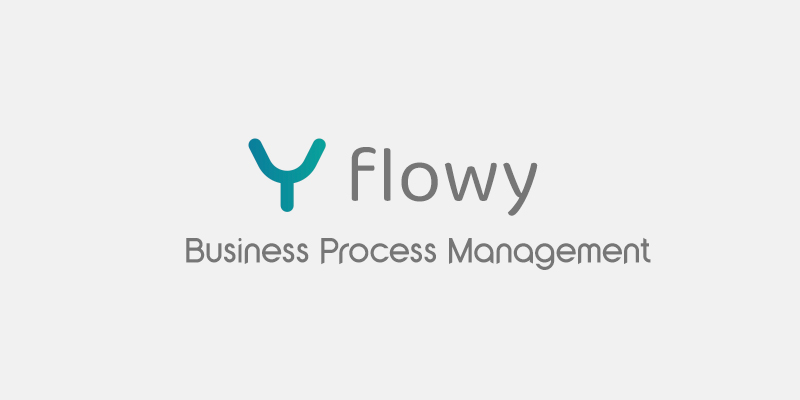
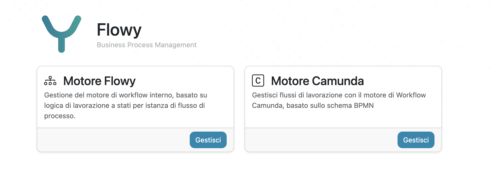
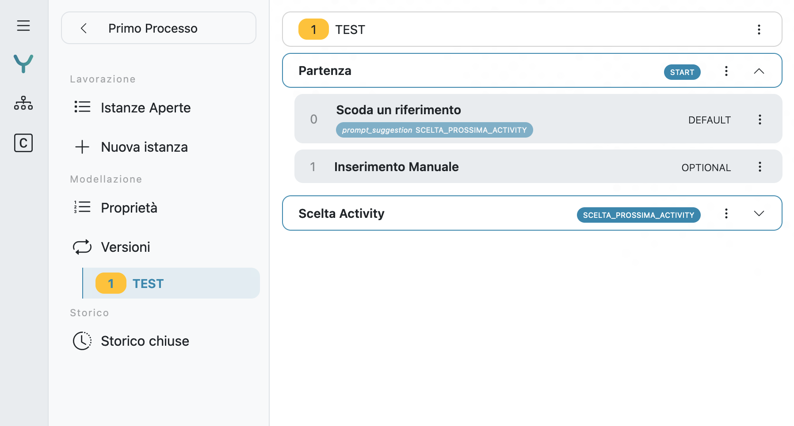
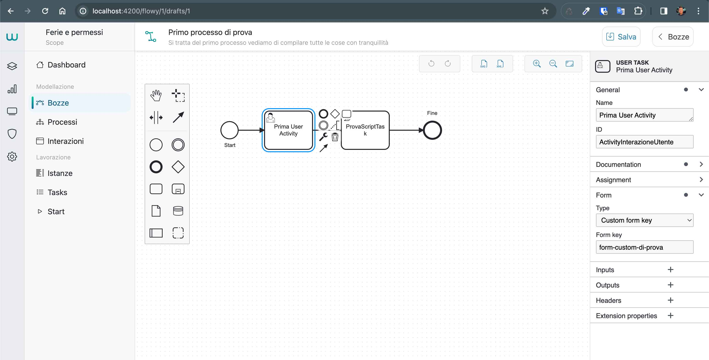
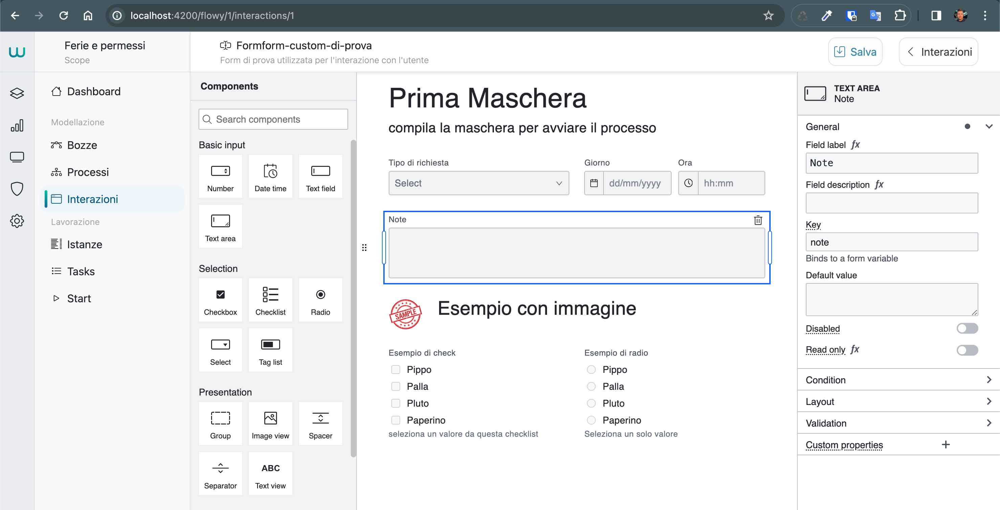
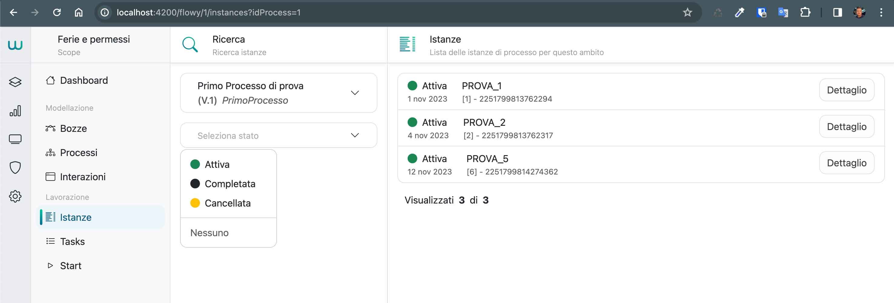

# Flowy

Il progetto Flowy rappresenta un sistema avanzato per la gestione dei processi aziendali, concepito per ottimizzare e orchestrare le operazioni all’interno di un’organizzazione. Questa soluzione si suddivide in tre moduli principali, ciascuno dei quali svolge un ruolo fondamentale nel garantire un flusso efficiente e strutturato delle attività. In sintesi, il progetto Flowy si propone di offrere una soluzione completa e integrata per ottimizzare le operazioni, mettendo a disposizione la possibilità di scegliere il motore di workflo più adatto alle esigenze di processo.

## flowy-engine
Questo modulo costituisce il cuore del sistema, offrendo un’API .NET dotata di un potente motore di workflow basato su una logica di lavorazione a stati. Durante il processo di esecuzione, il sistema segue un approccio dinamico, in cui le istanze di lavoro avanzano attraverso una serie di stati predefiniti. In base allo stato attuale, vengono attivate determinate azioni consentendo il progresso verso lo stato successivo. Questo approccio modulare e flessibile permette un controllo preciso e granulare del flusso di lavoro, conducendo inesorabilmente verso il completamento del processo.

Con Flowy-Engine è possibile definire più distribuzioni per lo stesso processo di lavorazione, gestendo così il versionamento del flusso di lavorazione di un processo in modo efficace e flessibile. Questo significa che è possibile creare e mantenere diverse versioni di un processo, consentendo agli utenti di scegliere la versione appropriata in base alle esigenze specifiche o alle modifiche apportate nel tempo.

Per ogni flusso di lavorazione, è possibile definire una serie di stati che rappresentano le diverse fasi attraverso cui passa il processo. Ogni stato è un punto di controllo chiave nel flusso di lavoro, dove vengono eseguite azioni specifiche e vengono prese decisioni cruciali per il progresso del processo.

All’interno di ciascuno stato, possono essere definite diverse interazioni che consentono agli utenti di interagire con il sistema. Queste interazioni possono assumere diverse forme, come maschere di interazione con l’utente, formulari per la raccolta dei dati o scelte che determinano il prossimo stato in cui si troverà l’istanza del processo.

Questo approccio modulare e altamente configurabile offre una grande flessibilità nella progettazione e nell’esecuzione dei processi aziendali, consentendo di adattare il flusso di lavoro alle esigenze specifiche dell’organizzazione e di rispondere rapidamente ai cambiamenti nel contesto operativo. Inoltre, la gestione del versionamento consente di mantenere un registro delle modifiche apportate ai processi nel tempo, garantendo la tracciabilità e la conformità alle normative aziendali e di settore.

## flowy-camunda
Questo modulo integra un’API .NET con la potente piattaforma Camunda8, riconosciuta a livello globale per la gestione avanzata dei flussi di processo secondo la notazione BPMN (Business Process Model and Notation). Grazie a questa integrazione, Flowy ottiene un supporto ancora più sofisticato per la gestione dei processi, consentendo di modellare, eseguire e monitorare i flussi operativi in conformità con gli standard BPMN. Questo modulo aggiunge una nuova dimensione alla capacità di gestione dei processi di Flowy, garantendo un controllo dettagliato e una visibilità completa su tutte le attività aziendali.

Il modulo Flowy-Camunda introduce una serie di funzionalità essenziali per la gestione avanzata dei processi aziendali, con particolare attenzione alla creazione e alla gestione delle bozze di processo, all’editing web dei flussi secondo gli standard BPMN e al deploy dei processi sulla potente piattaforma Camunda8. Ecco alcuni dei vantaggi e delle funzionalità offerte da Flowy-Camunda:

1. Gestione delle Bozze di Processo: Con Flowy-Camunda è possibile creare e gestire facilmente bozze di processo, consentendo agli utenti di definire e raffinare i flussi di lavoro in modo collaborativo e iterativo. Questo approccio facilita lo sviluppo e il perfezionamento dei processi aziendali, consentendo agli utenti di sperimentare e testare diverse configurazioni prima di renderle operative.
2. Editing Web dei Flussi con Standard BPMN: Il modulo offre un’interfaccia web intuitiva e user-friendly per la modellazione dei flussi di processo utilizzando gli standard BPMN (Business Process Model and Notation). Gli utenti possono trascinare e rilasciare gli elementi BPMN per definire le attività, le decisioni, i gateway e altri concetti di modellazione dei processi, consentendo una rappresentazione visiva chiara e comprensibile dei flussi operativi.
3. Deploy dei Processi su Camunda8: Flowy-Camunda semplifica il processo di deploy dei processi sulla piattaforma Camunda8, consentendo agli utenti di distribuire rapidamente i flussi di lavoro definiti sulla piattaforma di gestione dei processi aziendali. Questa integrazione garantisce un’implementazione fluida e efficiente dei processi, consentendo agli utenti di sfruttare appieno le potenzialità della piattaforma Camunda8 per l’esecuzione e il monitoraggio dei processi aziendali.

## flowy-app
Questo modulo rappresenta l’interfaccia utente centrale del sistema, sviluppata in Angular per offrire un’esperienza d’uso intuitiva e ricca di funzionalità. Attraverso Flowy-App, gli utenti possono non solo interagire con le funzionalità dei due motori principali, ma anche gestire e monitorare l’intero flusso di lavoro aziendale in modo efficiente. Grazie a un’interfaccia intuitiva e personalizzabile, Flowy-App offre agli utenti un accesso diretto alle risorse e alle informazioni necessarie per svolgere le proprie attività in modo efficace e produttivo.

